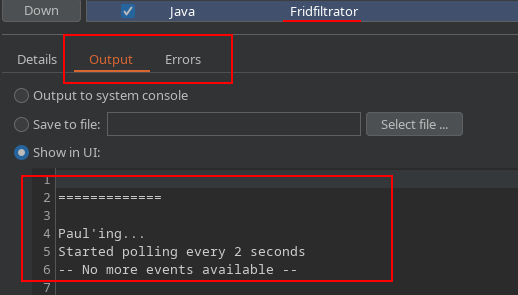
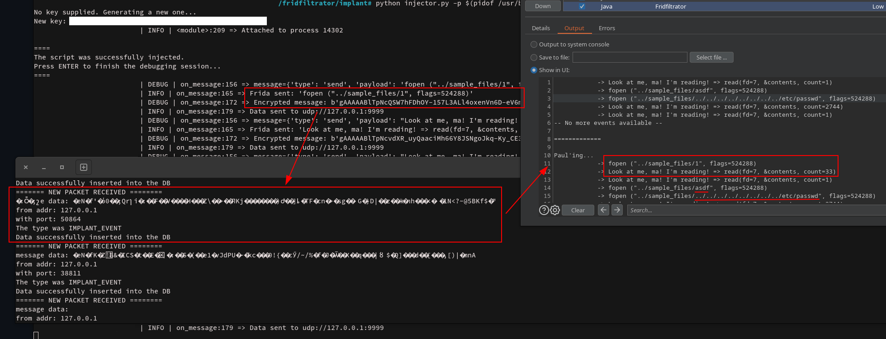

# Dafuq is dis shit?

Fridfiltrator is a tool to instrument web applications and obtain some insights about the path our payloads take when the application is processing them.
This is (apparently) called IAST: Interactive Application Security Testing.

The goal is to help discovering hidden vulnerabilities that would take too much time to properly test for, due to the lack of feedback.

An example use-case: a file being read (with some raw user-input to generate the filename) in the background and sent to another process to generate a report that we can download 5 minutes later.
Sure, we can test that if we have nothing else to do with our lives; but I got shit to do with my life besides pentesting...

It could also be useful for research, to minimise the setup time and help automatise fuzzing (I guess? it's not really my end goal, but I could see myself using it for vuln research).

The main idea of this project was [Burp's Infiltrator](https://portswigger.net/burp/documentation/desktop/tools/infiltrator).
It basically patches the bytecode of the app (it only supports JVM and .NET projects) and adds some hooks to generate an alert whenever a Burp payload triggers them.
This has a small problem, though: it doesn't work.
I tried to run it against a couple of test applications and the patching simply broke the apps, which wouldn't even start anymore.
Maybe I'm just an idiot and didn't properly configure it (more than likely, tbh), or maybe it's no longer actively developed by PortSwigger.

And, even if it did work, it has huge limitations, like the lack of extensibility (you can't configure which hooks are added) and the fact that it only supports .NET and JVM-based apps.
The first problem could be overcome with some effort to modify the patcher; but the second is a show-stopper, and a flaw on the design itself, since patching requires modifying the binary itself (which is very platform dependant and really tricky).


Luckily many things have changed since 2016 (when Burp Infiltrator [was announced](https://portswigger.net/blog/introducing-burp-infiltrator)), and new, very easy to use, tooling for instrumenting applications has been developed.
Among those tools, it's my favourite: [Frida](https://frida.re/).
This approach with Frida has four main advantages from my point of view:
  - Language-agnostic: all apps can be instrumented, regardless of their implementation language. This has some exceptions, like Golang sucking big ass and performing direct system calls; but they could be overcome with some work (i.e.: https://passthehashbrowns.github.io/detecting-direct-syscalls-with-frida + https://frida.re/docs/stalker/)
  - Easy to deploy: the client just needs to specify the PID to inject the implant, and everything is good to go
  - Fail-safe: If the implant fails (because my mad programming skills actually suck, for example), the app still goes on. I lose my telemetry, but I can still test without having to bother the client to reboot the whole system.
  - Low impact: if we're willing to ignore the fact that we're injecting a fucking JS engine, the performance impact is not _that_ high, and the application itself doesn't see it's behaviour modified. Let's remember that our end goal is to find vulnerabilities in the app: if we modify its behaviour, our test would be pointless.


For this revival of the Infiltrator's concept, I need the following components and actors working together:
  - The tester, using a custom extension in Burp
  - The client, who happily run the implant we send them on their app server :)
  - A redirector, which could be a Collaborator instance or a custom developed server, to receive the events sent by the implant and redirect them to the tester's Burp extension

A diagram showing thes relationships can be seen below:


# But why?

Have you ever tested an API endpoint that you have no idea what it does, but it _always_ returns "200 OK"?
Maybe the endpoint is vulnerable as fuck, but your
Yeah, I also hate that...


Unfortunately, the clients don't normally let us SSH into the server and start debugging the app to see what the hell it is doing.
I believe, however, that a valid compromise between "documentation? what's that?" and "here is all our source code and you can SSH as root to debug the app" is to ask the client to run a small piece of our code that would not affect the app itself (if our implant dies, the app should keep running), but could give us some telemetry to get more info about where does our payload end up.


## Isn't there like... a thousand tools already?

Maybe?

To be honest, the only things I found, besides Burp's Infiltrator, were a bunch of source code scanners, which are definitely not what I want to use (if the client gave you the source code, you can just use that rather than hacking together this shitty instrumentation thingy)

I did find a very nice Burp extension that uses Frida called [Brida](https://github.com/federicodotta/Brida).
It really is a nice project and will make sure to try it on my next mobile assessment; but it doesn't fit my current scenario because it requires a direct communication between the Frida Server and the extension, which I do not want because:
  - It would force the client to open a port on their firewall for us to communicate with the Frida Server, which sometimes might take several weeks (if the client agreed at all).
  - As a client, I would _never_ accept exposing a port that allows direct remote code execution, even if tunneled via SSH. Some clients don't even allow-list us in their WAF, so how could we ask them that?


And, besides that, I found nothing.
If you know of any other project with the same concept as Fridfiltrator, please open an [Issue](https://github.com/Foo-Manroot/fridfiltrator/issues) here and I will take a look.
Maybe my efforts are better directed by contributing to those other tools instead.


# Ok, you convinced me. How do I use this?

## 1: Run the target app

For testing, I created a bunch of test apps "vulnerable" to a path traversal (they're actually not exploitable... but whatever, that's not the point here, just use it agains WebGOAT if you want to pwn some stuff).

For example, you can use the app one with Flask:
```
$ cd sample_apps/Python-Flask/
$ ./serve.sh
 * Serving Flask app 'whatever'
 * Debug mode: off
WARNING: This is a development server. Do not use it in a production deployment. Use a production WSGI server instead.
 * Running on http://127.0.0.1:5000
Press CTRL+C to quit
```

If it doesn't work, check if you have all dependencies (Flask, basically) installed or use another of the sample apps (except the Go one, that doesn't work because reasons)


## 2: Instrument the app

For this step, you need to be able to debug the process; so either assign the correct capabilities to the binary, or just run this as root.
This is only a test setup, so for real-world usage this will probably have to change; maybe by spawning the app from Frida instead of hooking it.

```
# cd implant/
# python injector.py -p $(pidof /usr/bin/python /usr/bin/flask run)
No key supplied. Generating a new one...
New key: b'0KET_f5D_YcaSQicPfhEUJG0aIYDps0sFkgcj_BC9fQ='
[2023-11-10 21:13:55,459] | INFO | <module>:209 => Attached to process 14302

====
The script was successfully injected.
Press ENTER to finish the debugging session...
====

```

Make sure you have Frida and its Python bindings installed: `pip3 install frida frida-tools`


## 3: Start the redirector

```
$ cd redirector/
$ nimble install -d
(...)
$ nim c -r server.nim
(...)
Now accepting connections on udp://127.0.0.1:9999
```


## Step 4: Add the extension to Burp

You can use the pre-built JAR in `Burp extension/Fridfiltrator/Fridfiltrator-extension.jar` or build it yourself:
```
$ cd "Burp extension/Fridfiltrator"
$ ./gradlew build
(...)
BUILD SUCCESSFUL in 13s
5 actionable tasks: 5 executed
```

The output extension is `./app/build/libs/app.jar` and can be installed from Burp under "Extensions" > "Installed" > "Add" > (extension type: "Java" and select the JAR file) >


For now, all the output is simply sent to the extensions logging window:



## Step 5: Send some requests to the app and watch the interaction

```
$ curl -i 127.1:5000/api-or-smth?f=1
HTTP/1.1 200 OK
Server: Werkzeug/3.0.0 Python/3.11.5
Date: Fri, 10 Nov 2023 17:11:53 GMT
Content-Type: text/html; charset=utf-8
Content-Length: 44
Connection: close

I'm not giving you any output, u dum-dum :P
$ curl -i 127.1:5000/api-or-smth?f=asdf
HTTP/1.1 200 OK
Server: Werkzeug/3.0.0 Python/3.11.5
Date: Fri, 10 Nov 2023 17:12:01 GMT
Content-Type: text/html; charset=utf-8
Content-Length: 44
Connection: close

I'm not giving you any output, u dum-dum :P
$ curl -i 127.1:5000/api-or-smth?f=../../../../../../../../etc/passwd
HTTP/1.1 200 OK
Server: Werkzeug/3.0.0 Python/3.11.5
Date: Fri, 10 Nov 2023 17:12:15 GMT
Content-Type: text/html; charset=utf-8
Content-Length: 44
Connection: close

I'm not giving you any output, u dum-dum :P
```

The API responses are always the same (same headers, same timing, etc.), so a regular test would need way more time to catch this issue.
Going to back to the example at the beginning: if I have to wait 5 minutes per request, to see the output of my payload, I might lose the whole testing window for a single endpoint, whereas Fridfiltrator helped me finding this issue in a couple of seconds.



As a tester, I would see that the first request generates a `read()` to `sample_files/1`, which matches my input (`f=1`), whereas `f=asdf` doesn't generate a `read()` but it _does try_ to `open()` a file with my raw input.
For my last attempt, I send the usual path traversal payload to confirm I can indeed read any file, which does indeed trigger a `read()` of `/etc/passwd`.


# Contributing

Do you want to contribute?
Great! Thank you :)

I don't really have any requirements (this project isn't really big enough, and my code is not precisely good either, ngl), so feel free to just open a [pull request](https://github.com/Foo-Manroot/fridfiltrator/pulls).
[Issues](https://github.com/Foo-Manroot/fridfiltrator/issues) are also welcomed and will be addressed to the best of my capacity.


## Project structure

This is the main directory structure of the project:
```
.
├── Burp extension
│   └── Fridfiltrator
│       ├── app
│       │   └── src
│       │       └── main
│       │           └── java
│       │               └── Fridfiltrator
│       │                   ├── Fridfiltrator.java   <-- Extension loader, only controls the UI (aka: nothing right now)
│       │                   └── Poller.java          <-- Class responsible for gathering the results
│       ├── gradlew     <-- Used to build the extension (./gradlew build)
(...)
├── implant
│   ├── injected-script.js   <-- Script with the hooks that will be added to the target application
│   ├── injector.py          <-- Main script to manage the injection and sending the events to the redirector
(...)
├── redirector
│   ├── server.nim           <-- Redirector. Simply manages incoming events (msg_type 0x01) and polling attempts (msg_type 0x00)
(...)
└── sample_apps
    ├── Go... I fucking hate this, man     <-- A sample app using Golang, which uses direct syscalls (at least on GNU/Linux) and can't be easily instrumented
(...)
    ├── Java-Spring       <-- A sample app using Java with the Spring framework
(...)
    ├── NodeJS-Express    <-- A sample app using NodeJS with the ExpressJS framework, running inside a Docker container with Alpine (which uses musl instead of libc)
(...)
    ├── Python-Flask      <-- A sample app using Python with the Flask framework
(...)
    └── sample_files      <-- Just sample data to use with the vulnerable applications
        ├── 1
        └── 2
```


# References

- https://frida.re/ // https://github.com/frida/frida - The base instrumentation engine used by this project
- https://github.com/federicodotta/Brida - A similar idea, but with a different end goal (mobile testing, instead of remote instrumentation of web apps) and approach (directly interfacing with the Frida Server, instead of adding a static agent)
- https://portswigger.net/burp/documentation/desktop/tools/infiltrator - Information about Burp's Infiltrator, the original idea of this project
